## Tutorial 1: On Erasure Coding for Storage Applicaions

### 1. Historical Perspective

1.1 RAID-6

1.2 LDPC Codes（XOR codes for content distribution）

1.3 Network/Regenerating Codes（Distributed storage）

1.4 Non-MDS Codes（Clouds and Recovery）

### 2. Nomenclature

Q1： The distinction of systematic erasure code and non-systematic erasure code. 

> - Systematic: stores the data in the clear on k of the n disks.
> - Non-systematic: stores only coding information.
>
> 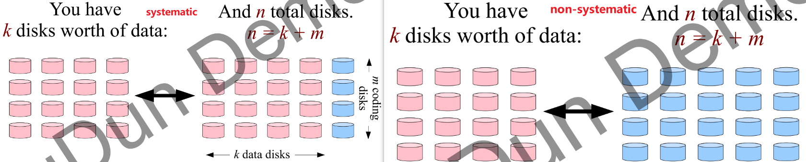
>
> - An MDS (“Maximum Distance Separable”) code can reconstruct the data from any m failures.

Q2: The distinction of vertical  code and horizontal  code.

> - Both systematic.
> - Horizontal: partitions the disks into data disks and coding disks.
> - Vertical: each disk is required to hold some data and some coding.
>
> 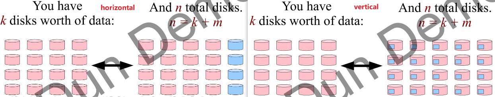

### 3. The Basics: Generator Matrices

>  nr x kr matrix of w-bit words

#### 3.1 Encoding with Generator Matrices

> - XORs only when w = 1
> - Otherwise use Galois Field arithmetic GF(2^w)（伽罗华域运算）
>   - Addition = XOR
>   - Multiplication uses special libraries (可转换成addition？)
> - An example of GF(2^3)
>   - 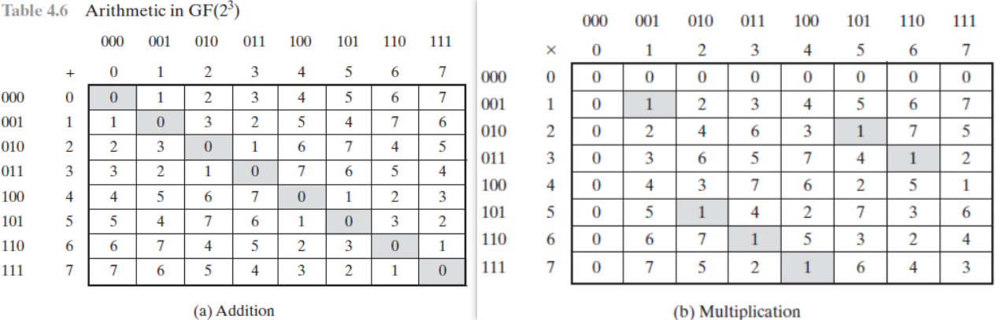
>   - 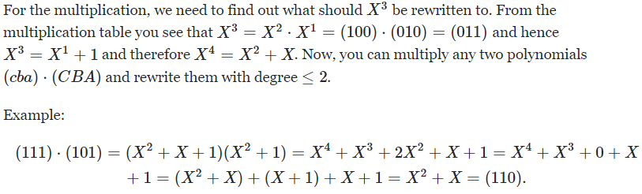

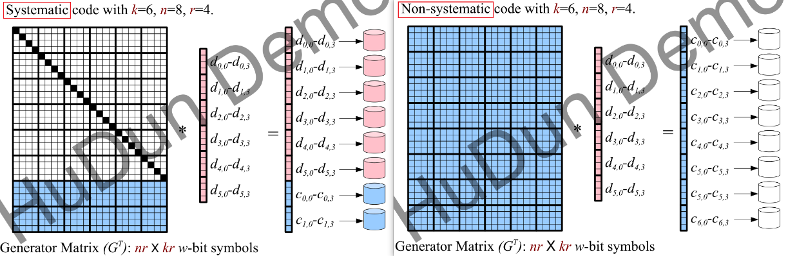

（r rows of w-bit symbols from each of n disks）

#### 3.2 Decoding with Generator Matrices

- Step #1: Delete rows that correspond to failed disks.
- Step #2: Rewrite this equation so that looks like math.
- Step #3: Invert B and multiply it by both sides of the equation.

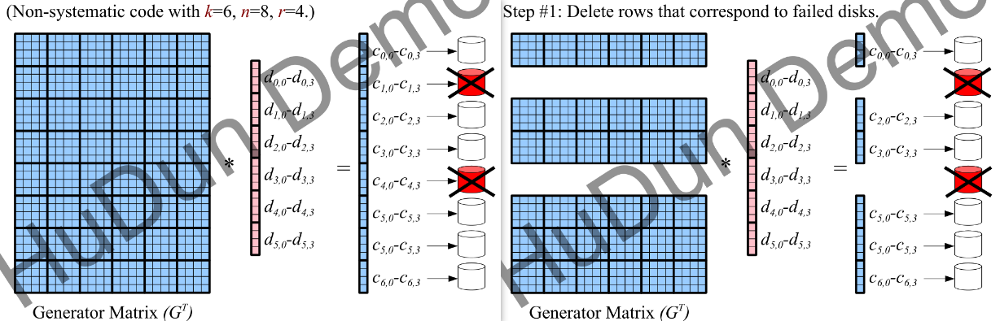

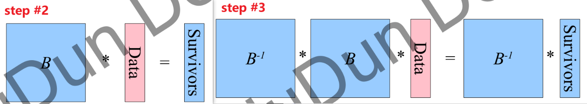

### 4. Reed-Solomon Codes（所罗门码）

#### 4.1 Properties and Constraints

- MDS Erasure codes for any n and k.
  - That means any m = (n-k) failures can be tolerated without data loss.
- r = 1，n ≤ 2^w
  - One word per disk per stripe
  - Uses Galois Field Arithmetic
- w constrained so that n ≤ 2^w.

### 5. Cauchy Reed-Solomon Codes（柯西所罗门码）

#### 5.1 Properties and Constraints

- w = 1，n ≤ 2^r
  - Uses only XOR's
- 可以通过r、w值的等价转换转化为Reed-Solomon codes

#### 5.2 Parity Check Matrix（奇偶校验矩阵）

##### 5.2.1 Definition

A Parity Check Matrix is an n × m matrix which, when multiplied by the codeword, equals a vector of zeros.

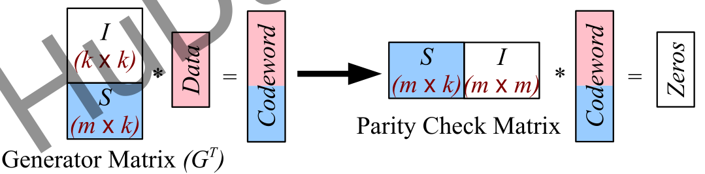

##### 5.2.2 Decoding with a Parity Check Matrix

- #1: Put the failed words on the right of the equations.
- #2: Calculate the left sides, since those all exist.
- #3: Solve using Gaussian Elimination or Matrix Inversion.

### 6. Linux RAID-6

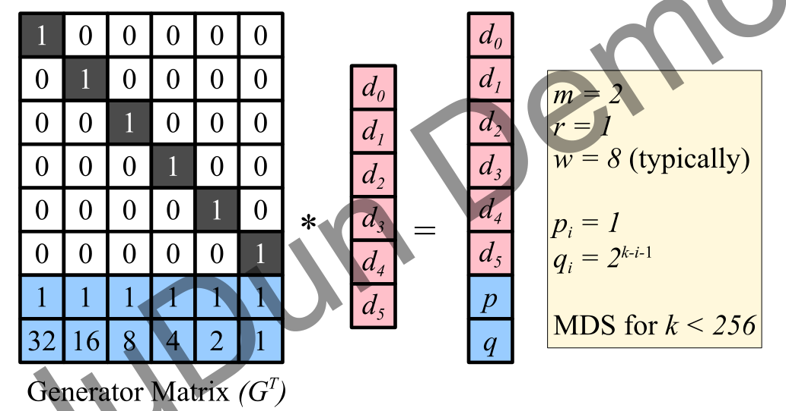

### 7. EVENODD（奇偶校验）

#### 7.1 Properties and Constraints

- RAID-6: m = 2 (P drive and Q drive)
- Systematic、Horizontal、MDS
- w = 1: Only XOR operations
- k must be a prime (that will be relaxed).
- r is set to k-1.

#### 7.2 Example about Encoding

- P drive
  - 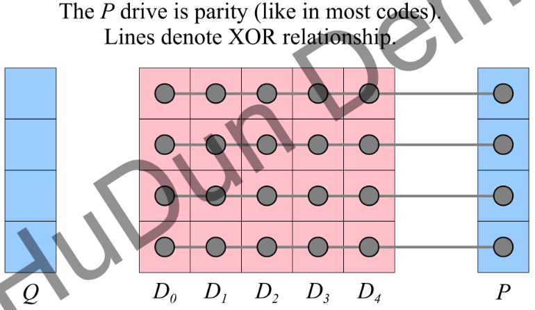
- Q drive: each diagonal chain is missing one data drive
  - 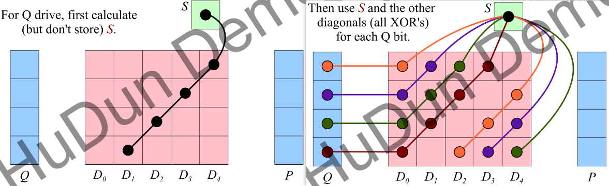
  - S equals the XOR of all of the bits in P and Q
    - 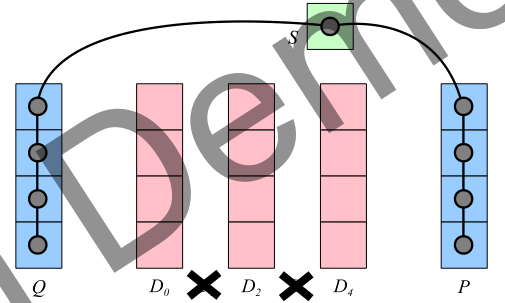

#### 7.4 Benefits and Downsides

- Benefits
  - XOR's faster than Galois Field arithmetic. 
  - Don't need matrices or linear algebra.
  - Recovery from single failures can be faster.
- Downsides
  - RDP is faster
  - Update Penalty is high

### 8. RDP（行对角线校验）

#### 8.1 Properties and Constraints

- Everything is the same as EVENODD, except you have to subtract one from k.
- k = r, and k+1 must be a prime number.
- Easiest explanation is to convert an instance of EVENODD to an instance of RDP.
  - First, get rid of S and P.
  - Then make the last data disk instead be the P disk.
  - 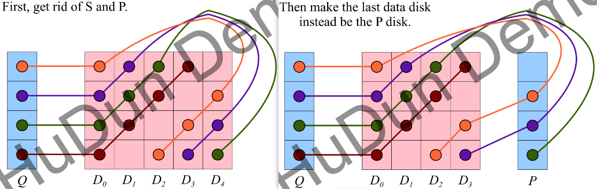

#### 8.2 Benefits and Downsides

- Benefits
  - Achieves a theoretical minimum on the number of XOR operations required for encoding and decoding.
  - Don't have to mess with S.
- Downsides
  - Cannot encode P and Q independently.
  - Update Penalty is high, same as EVENODD.
  - unsure of enforcement. (先计算P再计算Q更快)

### 9. X-Code

#### 9.1 Properties and Constraints

- RAID-6: m = 2
- Vertical、Systematic、MDS
- n must be prime, r = n
- example
  - 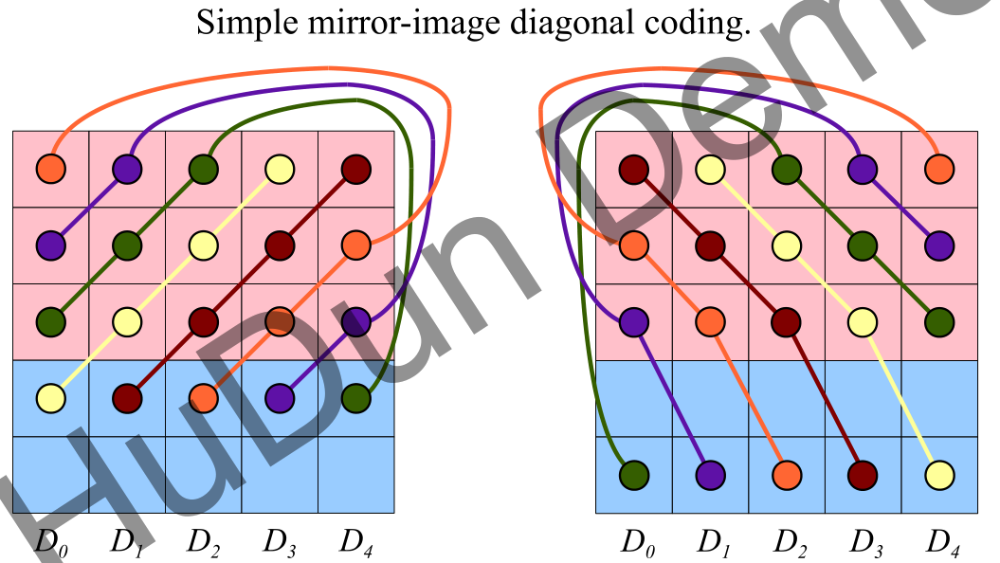

#### 9.2 Benefits and Downsides

- Benefits
  - Achieves a theoretical minimum on encoding, decoding and update penalty.
- Downsides
  - Cannot easily shorten a vertical code.
  - Patent exists.

### 10. Other Bit-Matrix Codes

- Methodology
  - Use a generator matrix defined by the specific erasure code for k, n, and **r、w must equal 1**.
  - Only XOR's.
  - Use heuristics to identify common XOR operations to improve performance of both encoding and decoding.
- Benefits
  - Not really CPU performance.
  - Can save you I/O on recovery.

### 11. Summary or Leftover Problem

1. 设计erasure codes需要考虑的指标

   - 存储开销Storage Cost（是否节省空间）
   - encoding and decoding 的计算复杂度/效率
   - 纠错能力/效率 reconstruction cost
   - 更新数据的代价（更新惩罚）
   - 可靠性 reliability
   - 其他
   
2. Generator Matrix, Parity-Check Matrix 和 Generalized Vandermonde Matrix 的区别

   - Generator Matrix: nr x kr matrix of w-bit words/symbols, [详见3.1](#3.1 Encoding with Generator Matrices)
   - Parity-Check Matrix: an n × m matrix which, when multiplied by the codeword, equals a vector of zeros. [详见5.2](#5.2 Parity Check Matrix（奇偶校验矩阵）)
   - Vandermonde matrix: 如下形式
     - 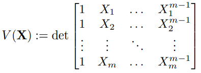

3. 存在问题

   - 如何计算更新惩罚？
   - field size 对 erasure coding 的作用及影响。

## Tutorial 2: Erasure Coding in Cloud Storage

### 1. Three Dimensions of Cloud Storage

- Performance
- Storage Cost
- Reliability

### 2. Pyramid Codes

#### 2.1 Construction

- take an arbitrary Reed-Solomon (RS) code (采用任意的里德所罗门（RS）代码)
- **split one RS parity into multiple local parities**

### 3. Maximal Recoverability 

#### 3.1 Recoverability Theorem

- full matching (in decoding Tanner graph) → recoverable
- Maximally Recoverable (MR) codes
  - Generalized Pyramid Codes (GPC) - 2007
  - Local Reconstruction Codes (LRC) - 2012
    - deployed in WAS
  - Partial-MDS codes (PMDS) - 2012

#### 3.2 Maximal Recoverable property

- **Decode any failure pattern which is information-theoretically decodable**.
  - information-theoretically decodable: failure patterns that are possible to reconstruct.

### 4. LRC in Windows Azure Storage

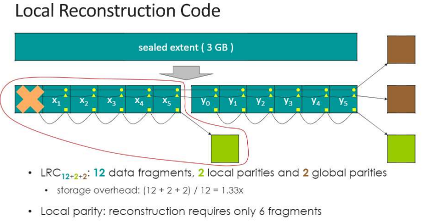

### 5. PMDS and SD Codes

Q: The distinction of PMDS Codes and SD Codes.

> - Common
>   - m rows, n columns → n drives, m × n sectors
>   - r row parities in each row
>   - s global parities
>   - 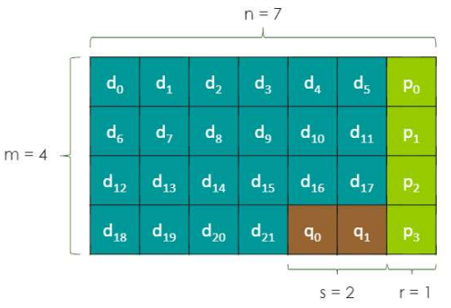
> - Difference
>   - PMDS: tolerate **r failures per row** and s additional anywhere
>     - Studied in paper *[“Partial-MDS codes and their application to RAID type of architectures”](https://researchain.net/archives/pdf/Partial-Mds-Codes-And-Their-Application-To-Raid-Type-Of-Architectures-2580416)*
>   - SD: tolerate **r column failures** and s additional failures anywhere
>   - Any (r, s) PMDS code is an (r, s) SD code
>   - Example
>     - PMDS Codes tolerate both case I and II, but SD codes only tolerate case I 
>     - 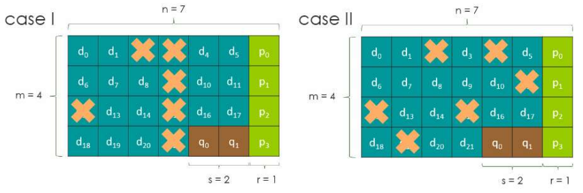
>     - why?

### 6. Research Chanllenge

#### Efficient Repair of Existing Codes

Enumerate Decoding Equations → Find Shortest Path on Weighted Graph

#### Theoretical Bound on Efficient Repair

- Efficient repair of (n,k) MDS codes
  - single node failure
  - 1/(n-k) fraction of data from all the (n-1) surviving nodes

#### Simple Regenerating Codes

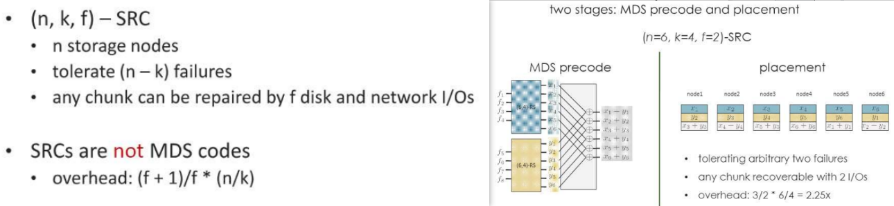

#### Rotated Reed-Solomon Codes

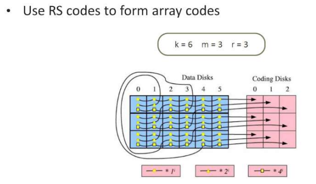

### 7. Summary or Leftover Problem

- Theoretical Bound on Efficient Repair部分有待进一步理解
- Partial MDS codes和 SD codes的区别
- Maximum Distance Separable(MDS) codes
  - minimal distance d,  the smallest number of concurrent node failures that may cause data loss.
  - for MDS codes, **d = n - k + 1**, while n is the total number of blocks and k is the number of data blocks

## LRC: Locally Reconstruction Codes

> Notes and Summary from:
>
> paper #1: *"Erasure Coding in Windows Azure Storage"*
>
> paper #2: *"On Fault Tolerance, Locality, and Optimality in Locally Repairable Codes"*

### 1. LRC in WAS

#### 1.1 Definition

- **(k, l, r) LRC** 
  - divides k data fragments into l groups, with k/l data fragments in each group. 
  - **one local parity within each group**. 
  - **r global parities** from all the data fragments. 
  - **n** is the total number of fragments (data + parity). n = k + l + r. 
  - normalized **storage overhead** is n/k = 1 + (l + r)/k.

- example: (6, 2, 2)LRC
  - 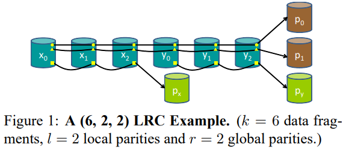
  - **Tolerate arbitrary 3 failures and information-theoretically decodable 4 failures.**

#### 1.2 Fault Tolerance

- Achieve the Maximally Recoverable(MR) property
  - what is **MR**? See [Tutorial 2: 3.2](#3.2 Maximal Recoverable property)
- For any (n, k) linear code (with k data symbols and n − k parity symbols) to have the proper:
  - **arbitrary r + 1 symbol failures** can be decoded
  -  single data symbol failure can be recovered from k/l(向上取整) symbols
  - **n − k ≥ l + r**

- **For information-theoretically decodable, tolerate failures more than r+1 (up to l+r)**

#### 1.3 Reliability

- Markov Reliability Model
  - 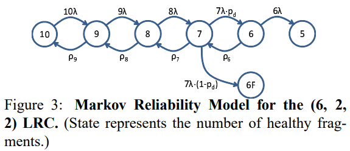
  - λ denote the failure rate of a **single fragment**
  - State 6 represents a state where there are four decodable failures, while 6F represents non-decodable
  - pd denote **the percentage of decodable four failure cases**
  - ρ9 denote the transition rate from one fragment failure back to all fragments healthy == the **average repair rate of single-fragment failures**
    - Assume there are M storage nodes in the system, each with S storage space and B network bandwidth
    - when a single node fails, remains (M-1) nodes
    - repair traffic only uses e of the network bandwidth on each machine
    - cost of repairing one failure fragment is C
    - then ρ9 = e(M − 1)B/(SC)
  - T denote the detection and triggering time, ρ8 = ρ7 = ρ6 = 1/T
- Factors
  - fault domain
  - parameters setting

#### 1.4 Implementation in WAS

##### 1.4.1  Stream Layer

- Architecture
  - 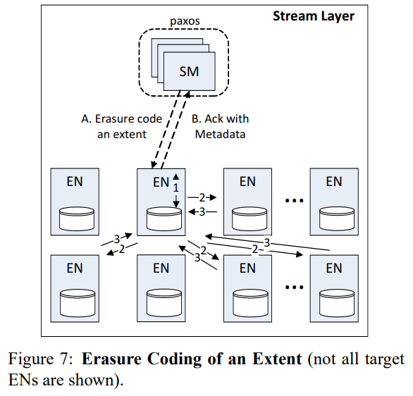
- main components
  - Stream Managers (SM)
  - Extent Nodes (EN)
    - Each extent consists of a list of append blocks.
    - Each extent is replicated on multiple (usually three) ENs.
- Working Mechanism
  - Each write operation is committed to all nodes in a replica set in a daisy chain before sending ACK back to client.
  - Write operations for a stream keep appending to an extent until the extent reaches its maximum size or until there is a failure in the replica set, and then the extent is sealed.
  - The sealed extent become a candidate for erasure coding.

##### 1.4.2 Erasure Coding in the Stream Layer

- The SM periodically scans all sealed extents and schedules a subset of them for erasure coding based on stream policies and system load.
- **The process**
  1. SM creates fragments on a set of ENs.
  2. SM designates one of the ENs in the extent's replica set as the coordinator and sends it the metadata for the replica set.
  3. The coordinator EN break the full extent into fragments at append block boundaries, deciding the fragments offsets.
  4. The coordinator EN starts the encoding process and keeps sending the encoded fragments to their designated ENs.
  5. Each EN keeps track of the progress made and persists that information into each new fragment.
  6.  After an entire extent is coded, the coordinator EN notifies the SM, which updates the metadata of the extent with fragment boundaries and completion flags, and then delete the full replicas of the extent.

##### 1.4.3 Using LRC in Windows Azure Storage

- Application: Each extent is divided into k equal-size data fragments. Then l local and r global parity fragments are created.
- Two considerable of the placement of the fragments
  - load, which favors less occupied and less loaded extent nodes;
  - reliability, which avoids placing two fragments  into the same correlated domain
- Two considerable and primary correlated domains
  - fault domain: a group of nodes which can fail together due to common hardware failure
  - upgrade domain: a group of nodes which are taken offline and upgraded at the same time during each upgrade cycle
    - too many upgrade domains can slow down upgrades, it's better to keep fewer.
    - strategies: exploit the local group property of LRC and group fragments belonging to different local groups into same upgrade domains.

##### 1.4.4 Designing for Erasure Coding

- Scheduling of Various I/O Types
  - efficiently scheduling and throttling of erasure coding and  decoding
  - erasure coding needs to be scheduled to keeps up with the incoming rate of data
- Reconstruction Read-ahead and Caching
  - done in unit sizes to reduce I/O
- Consistency of Coded Data
  - CRC (Cyclic Redundancy Check) 
  - check the header with CRC of the data when the data is written and every time data is read, after erasure coding and reconstruction
- Arithmetic for Erasure Coding
  - optimize Galois Field arithmetic operations by pre-computing and using addition and multiplication tables.

#### 1.5 Benefits

- Reduce the minimal number of fragments that need to be read from to reconstruct a data fragment
- Keep the storage overhead low
- Reduce the badwith and I/Os required for repair reads over prior codes

### 2. Existing LRC Approaches and their Evaluation Metrics

> **Evaluation Metrics**
>
> Assume **n** is the total number of blocks(data + parity), **k** is the number of data blocks, **r** is the maximal number of blocks required for the recovery of any block or a data block, d is the minimal distance. **bi** is the ith block in the code, and **cost(bi)** is the number of blocks required for the repair of bi.
>
> - Definition of some metrics
>
>   - average degraded read cost
>     - 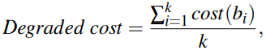
>     - the average cost of repairing data blocks
>
>   - average repair cost(ARC)
>     - 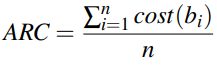
>     - the average cost of repairing a failed block.
>
>   - normalized repair cost(NRC)
>     - 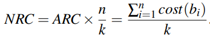
>     - the average cost of repairing a failed data block.
>
>   - mean time to data loss (MTTDL)
>
>   - storage overhead (n/k)
>   - minimal distance (d)
>   - repair-distance ratio(rd-ratio)
>     - NRC/d
>     - our goal: maximizing s while minimizing NRC
>
> - For fault tolerance: d(large-scale scenarios), MTTDL(small-set scenarios)

#### 2.1 Xorbas

- Special: Xorbas ensures that any of the global parities can be reconstructed by the remaining global parities and the two local parities.
- Example
  - 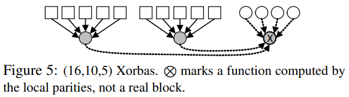

#### 2.2 Azure-LRC

- **data-LRCs**
  - information-symbol locality, for (n,k,r) LRCs, only the data blocks can be repaired in a local fashion by r surviving blocks, while the global parities require k blocks for recovery.

- Pyramid and Azure-LRC are data-LRCs.
- Construction
  -  for (n, k,r) where r divides k, and the number of local parities is l = k/r.
  - where r does not divide k, the number of local parities is l = k/r(向上取整)
  - k + l < n

#### 2.3 Azure-LRC + 1

- **full-LRCs**
  - all-symbol locality, all the blocks, including the global parities, can be repaired locally from r surviving blocks.

- Construction
  - non-MDS codes
  - based on Azure-LRC and supports efficient recovery of all parity blocks.
  - have l + 1 local parities,  l = k/r(向上取整), k + l + 1 < n
  - **a local parity added to a ‘group’ of one global parity**
- Example
  - 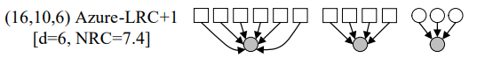

#### 2.4 Optimal-LRCs

- Construction
  - A full-LRC.
  - k data blocks and m global parities are divided into groups of size r, and a local parity is added to each group.
  - requires that **n mod (r + 1) ≠ 1**
  - the minimum distance
    - 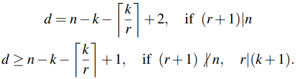
- Example
  - 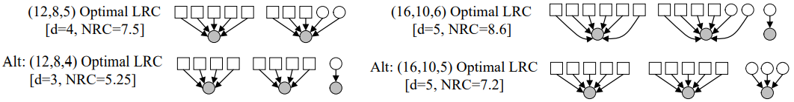

### 3. Summary or Leftover Problems

- 待了解state-of-the-art erasure codes

